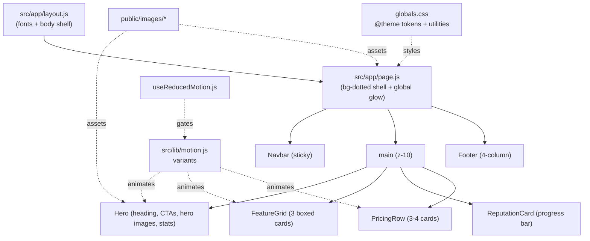
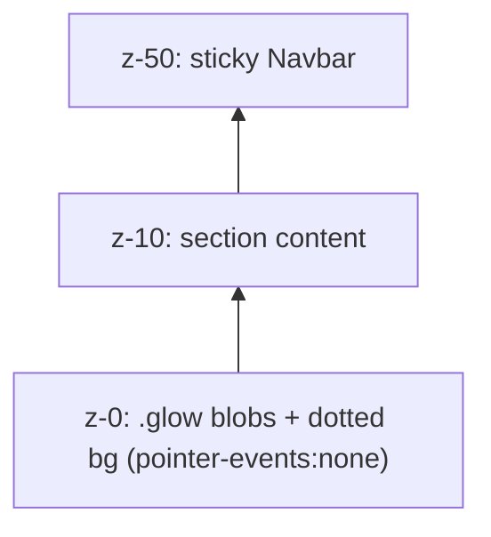
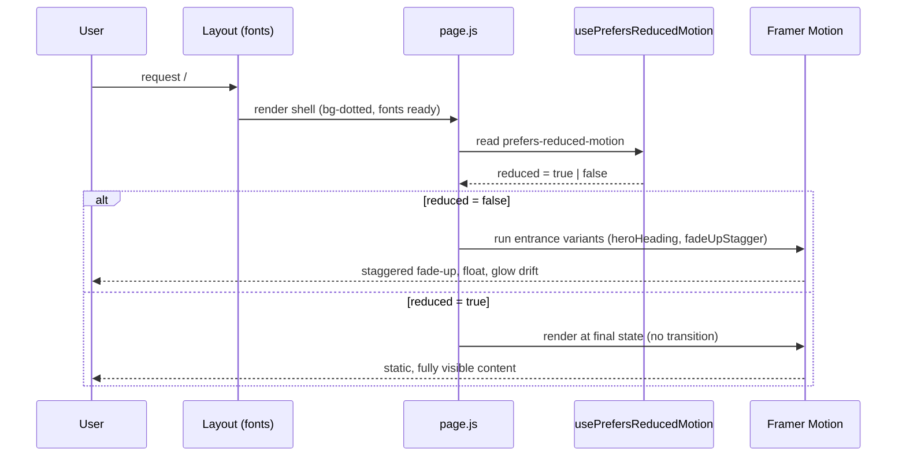
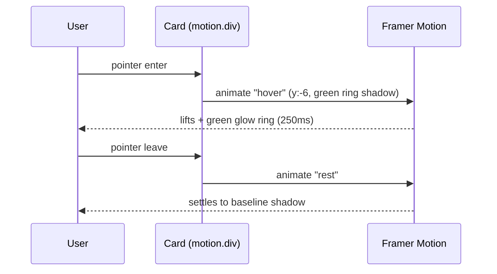

# Design Document: Landing UI Redesign (Trustmailtoday)

## Overview

This redesign aligns the Trustmailtoday marketing landing page with the visual language of [zerogpu.ai](https://zerogpu.ai): a very deep slate/near-black canvas, a subtle dotted radial background, soft radial green/teal glows, dense typography, and boxed feature cards with soft green accents. The product is an email-warmup / inbox-reputation SaaS, so the visual system needs to feel technical, trustworthy, and "deliverability-grade."

The work is an **integration refactor**, not a greenfield build. The project already ships a working dark/green design system in `src/app/globals.css`, shared Framer Motion variants in `src/lib/motion.js`, a `usePrefersReducedMotion` hook in `src/lib/useReducedMotion.js`, and five landing components (`Navbar`, `Hero`, `Features`, `Pricing`, `Footer`). This design formalizes the token system, codifies the exact color/spacing/motion contracts, introduces image-backed hero/glow visuals under `public/images`, and tightens accessibility and reduced-motion behavior. The goal is a copy-paste-ready spec that maps cleanly onto the existing files.

Because the repo is on **Tailwind v4** (CSS-first `@theme inline` config, no `tailwind.config.js`) and **Next.js App Router (16.x)**, this design expresses tokens in the v4 CSS-first idiom and also provides the equivalent legacy `tailwind.config` snippet for reference. All code examples are JavaScript/JSX to match the existing `.js` component files.

> **Engineering note (Next.js version):** This project pins `next@16.2.7`, which has conventions that differ from older releases. Before implementing, consult `node_modules/next/dist/docs/` for the `next/font`, `next/image`, and App Router guidance relevant to each component. The design favors patterns already proven to work in the existing codebase.

## Architecture

The landing page is a single App Router server route (`src/app/page.js`) that composes client components. The dotted background and one global glow live on the page shell; each section owns its local glows, motion, and imagery.



### Layering model

Every section uses a deliberate z-index stack so glows never intercept clicks and content always sits on top:



### Design decisions and rationale

- **CSS-first tokens (Tailwind v4 `@theme inline`)** instead of a JS config: matches the repo's existing setup, keeps tokens co-located with utilities, and avoids reintroducing a `tailwind.config.js` that the project deliberately omits.
- **Glows as absolutely-positioned blurred divs** rather than background images: cheaper to animate, theming-friendly, and already established in `globals.css`. A static `glow-bottom-right.png` is offered as an optional performance fallback.
- **Images via `next/image`** for hero art to get automatic sizing/lazy-loading; decorative patterns stay as CSS to avoid layout cost.
- **Motion centralized in `src/lib/motion.js`**: a single source of truth for entrance, stagger, hover-lift, and float so all sections feel cohesive and reduced-motion can be applied uniformly.

## Sequence Diagrams

### Page entrance / load animation flow



### Card hover-lift interaction



## Components and Interfaces

The landing renders six client components plus the page shell. Each is a `"use client"` module (motion + interactivity). Props are intentionally minimal — content is largely co-located, matching the current codebase — but the design defines optional prop contracts so components can later be made data-driven.

### Page shell — `src/app/page.js`

**Purpose**: Server component composing the landing; owns the dotted background and one global glow.

**Responsibilities**:
- Apply `.bg-dotted`, `relative`, `min-h-screen`, `overflow-x-hidden`.
- Render one decorative `.glow.glow--teal.glow--top-left` (`aria-hidden`).
- Order sections: `Navbar → main(Hero, Features, ReputationCard?, Pricing) → Footer`.

### Component 1: Navbar

**Purpose**: Sticky top navigation with small logo, anchor links, and a primary CTA.

**Interface**:
```js
/**
 * @typedef {Object} NavLink
 * @property {string} label
 * @property {string} href   // in-page anchor, e.g. "#features"
 */
function Navbar(props: {
  links?: NavLink[],          // defaults to Home/Features/Pricing
  ctaLabel?: string,          // default "Get started"
  ctaHref?: string,           // default "#start"
  logoSrc?: string,           // default "/images/logo-green.png"
}): JSX.Element
```

**Responsibilities**:
- `fixed inset-x-0 top-0 z-50`; transparent at top, frosted (`bg-[#071018]/80 backdrop-blur-md` + hairline border) after `scrollY > 12`.
- Height 64px (`h-16`), max width 1200px, horizontal padding 20px mobile / 32px ≥sm.
- Desktop links + CTA; mobile hamburger toggling an accessible panel (`aria-expanded`).
- Entrance: slide down from `y:-80`.

### Component 2: Hero

**Purpose**: Above-the-fold value proposition — heading, subhead, two CTAs, two hero images (left/right), and a 3-up stats row.

**Interface**:
```js
function Hero(props: {
  badge?: string,                  // "AI deliverability engine"
  heading?: ReactNode,
  subhead?: string,
  primaryCta?: { label, href },    // "Start warming free" -> "#start"
  secondaryCta?: { label, href },  // "See how it works" -> "#features"
  stats?: { value: string, label: string }[],
  heroLeftSrc?: string,            // "/images/hero-left.png"
  heroRightSrc?: string,           // "/images/hero-right.png"
}): JSX.Element
```

**Responsibilities**:
- Two-column grid at `lg` (`grid-cols-2`), single column below; `gap-12`, max width 1200px.
- Section padding: `pt-32 sm:pt-36 pb-24` (top clears the fixed navbar).
- Local glow: `.glow.glow--green.glow--bottom-right`.
- Heading uses `heroHeading` variant (blur-in + rise); subhead/stats use `fadeUpStagger` with incrementing `custom` index.
- Right column: floating inbox mock card (`animate-float`) plus the `ConnectInboxForm` (existing) and `hero-right.png`; `hero-left.png` anchors the left visual band.
- Two CTAs: primary `bg-brand-gradient`, secondary outline/ghost.

### Component 3: FeatureGrid (Features)

**Purpose**: Three boxed feature cards with green icon chips and inline mini-visuals.

**Interface**:
```js
/**
 * @typedef {Object} Feature
 * @property {React.ComponentType} icon   // lucide-react icon
 * @property {string} title
 * @property {string} desc
 * @property {"ramp"|"score"|"placement"} visual
 */
function Features(props: { items?: Feature[] }): JSX.Element
```

**Responsibilities**:
- Centered section header, then `grid md:grid-cols-3 gap-6 mt-14`.
- Each card: `.card-ring` (hairline + hover green ring), `rounded-2xl`, `bg-surface`, `p-7`, `min-h-[240px]`.
- Icon chip: 48×48 (`h-12 w-12`), `rounded-xl`, green tint background + ring.
- Per-card entrance via `fadeUpStagger` (custom index = position); hover via `cardHover`.

### Component 4: ReputationCard

**Purpose**: A standalone dark card showcasing a sender-reputation progress bar with micro-copy (deliverable #7).

**Interface**:
```js
function ReputationCard(props: {
  score?: number,        // 0..100, default 92
  label?: string,        // "Sender reputation"
  caption?: string,      // micro copy under the bar
}): JSX.Element
```

**Responsibilities**:
- Dark `.card-ring` card; green gradient progress track animating width from 0 → `score%` on in-view.
- Numeric score badge in green; micro-copy in muted text.
- Width animation gated by reduced-motion (renders at final width if reduced).

### Component 5: PricingRow (Pricing)

**Purpose**: Plan cards (existing layout supports 4; the zerogpu-style reference favors a 3-up emphasis with one highlighted "Most Popular").

**Interface**:
```js
/**
 * @typedef {Object} Plan
 * @property {string} key, name, price, period, tagline, cta
 * @property {string[]} features
 * @property {boolean} highlight
 */
function Pricing(props: { plans?: Plan[] }): JSX.Element
```

**Responsibilities**:
- `grid md:grid-cols-2 lg:grid-cols-4 gap-6` (preserve current 4-plan structure; highlighted plan gets green ring + gradient surface + "Most Popular" pill).
- Cards `rounded-[20px] p-7`, flex column, CTA pinned at bottom with `bg-brand-gradient`.
- Async checkout flow preserved (`startCheckout`), with inline notice states (ok/err/info).
- Entrance `fadeUpStagger`; hover `cardHover`.

### Component 6: Footer

**Purpose**: Four-column footer with brand block, link columns, socials, and legal bar.

**Interface**:
```js
function Footer(props: {
  columns?: { title: string, links: { label, href }[] }[],
  socials?: { icon, href, label }[],
}): JSX.Element
```

**Responsibilities**:
- `border-t` hairline, `bg-surface`; grid `md:grid-cols-2 lg:grid-cols-6` (brand spans 2, four link columns).
- Section padding `px-5 sm:px-8 py-14`; legal sub-bar with copyright.
- Entrance via `whileInView` slide-up.

## Data Models

These are presentational/config models — no backend schema changes. They define the shape of content fed into components and the token contract.

### Model 1: Color palette (design tokens)

| Token | Hex | Usage |
|-------|-----|-------|
| `primary` (brand-500) | `#22c55e` | Primary green: CTAs, icons, accents, progress |
| `primary-600` (brand-600) | `#0f9d58` | Gradient end, hover/darker green |
| `brand-700` | `#0a7d46` | Deep green for `from-[#0a1d14]` style surfaces |
| `darkBG` | `#071018` | Page canvas (very deep slate/near-black) |
| `surface` | `#0f1722` | Cards, navbar (frosted), panels |
| `surface-2` | `#131d2a` | Inset rows, hover backgrounds, progress track |
| `hairline` | `#1c2733` | 1px borders / dividers |
| `muted` | `#8aa0b2` | Secondary/body text on dark |
| `text-base` | `#e8eef3` | Primary body text on dark |
| `accentTeal` | `#015b71` | Teal glow + info notice tints |
| `highlight` | `#d6ff9a` | Yellow-green micro accents (badges, gradient start) |

**Validation rules**:
- Body text (`#8aa0b2`) on `#071018` must meet WCAG AA for the size used (≥4.5:1 for body, ≥3:1 for large/bold). Prefer `#e8eef3` for any small critical text.
- Green-on-dark accent text uses `#22c55e`; never place green text on green-tinted fills below 3:1.
- CTA text on `bg-brand-gradient` uses `#071018` (dark-on-green) for strong contrast.

### Model 2: Spacing scale (exact px)

| Name | px | Tailwind | Applied to |
|------|----|----------|-----------|
| container-max | 1200 | `max-w-[1200px]` | All section inner wrappers |
| gutter-mobile | 20 | `px-5` | Section horizontal padding < sm |
| gutter-desk | 32 | `px-8` | Section horizontal padding ≥ sm |
| hero-top | 128 / 144 | `pt-32 sm:pt-36` | Hero top (clears 64px navbar + breathing room) |
| hero-bottom | 96 | `pb-24` | Hero bottom |
| section-y | 96 | `py-24` | Features / Pricing vertical rhythm |
| grid-gap | 24 | `gap-6` | Card grids |
| hero-col-gap | 48 | `gap-12` | Hero two-column gap |
| card-pad | 28 | `p-7` | Feature/Pricing card padding |
| card-radius-lg | 20 | `rounded-[20px]` | Pricing cards |
| card-radius | 16 | `rounded-2xl` | Feature cards |
| icon-chip | 48 | `h-12 w-12` | Feature icon chips |
| navbar-h | 64 | `h-16` | Navbar height |
| dot-grid | 22 | `background-size: 22px` | Dotted background cell |

### Model 3: Layout tree with sizes

```text
Page (bg-dotted, min-h-screen, overflow-x-hidden, relative)
├─ glow.teal.top-left            380×380, blur 80px, opacity .5, z-0
├─ Navbar  (fixed, z-50)         h:64  maxW:1200  px:20/32
│   ├─ Logo                      32×32 chip + wordmark
│   ├─ Links (md+)               gap:32
│   └─ CTA                       px:20 py:10 (px-5 py-2.5)
├─ main (relative z-10)
│   ├─ Hero (pt:128/144 pb:96)
│   │   ├─ glow.green.bottom-right   420×420, z-0
│   │   ├─ grid lg:2col gap:48 maxW:1200
│   │   ├─ Left col: badge, h1(clamp 34–56), subhead(maxW:520), CTAs, stats(3× gap:16)
│   │   └─ Right col: hero-right image + float inbox card(maxW:448) + ConnectInboxForm
│   ├─ Features (py:96)
│   │   ├─ header (maxW:672 centered)
│   │   └─ grid md:3col gap:24 → card(minH:240, p:28, r:16)
│   ├─ ReputationCard (optional)  card(p:28, r:16), progress h:10
│   └─ Pricing (py:96)
│       ├─ header (maxW:672 centered)
│       └─ grid md:2 lg:4 gap:24 → card(p:28, r:20)
└─ Footer (border-t, bg-surface)
    └─ grid md:2 lg:6 gap:40, px:20/32 py:56  +  legal sub-bar
```

### Model 4: Image manifest — `public/images/`

| Filename | Purpose | Suggested size | Placement |
|----------|---------|----------------|-----------|
| `hero-left.png` | Left hero visual band / accent art | 720×720 (transparent PNG) | Hero left column backdrop |
| `hero-right.png` | Right hero product/inbox visual | 720×900 | Hero right column, behind/with float card |
| `dot-pattern.png` | Optional raster fallback for dotted bg | 88×88 tileable | `bg-dotted` fallback only |
| `glow-bottom-right.png` | Optional static glow (perf fallback) | 600×600 radial PNG | Replaces animated `.glow` if needed |
| `icon-send.png` | Feature/marketing raster icon | 96×96 | Feature card or social |
| `icon-score.png` | Reputation/score raster icon | 96×96 | ReputationCard / feature |
| `logo-green.png` | Brand logo (green Shield mark) | 64×64 @2x | Navbar + Footer |

**Validation rules**:
- All ``/`next/image` need descriptive `alt`; purely decorative art uses `alt=""` + `aria-hidden`.
- Hero images set explicit `width`/`height` (or `fill` + sized parent) to prevent CLS.
- Prefer `.webp`/`.avif` source where possible; `.png` names above are the contract used by JSX.

## Tailwind v4 Token Configuration

The project uses Tailwind v4 (CSS-first). Tokens live in `globals.css` under `@theme inline`. The existing block is sound; the additions below complete the deliverable (boxShadow + backgroundImage patterns + spacing helpers).

```css
/* src/app/globals.css — additions/confirmations inside @theme inline */
@theme inline {
  /* fonts (wired from next/font in layout.js) */
  --font-sans: var(--font-inter), ui-sans-serif, system-ui, sans-serif;
  --font-heading: var(--font-poppins), var(--font-inter), sans-serif;

  /* greens */
  --color-brand-50:  #ecfdf5;
  --color-brand-100: #d1fae5;
  --color-brand-200: #a7f3d0;
  --color-brand-300: #6ee7b7;
  --color-brand-400: #34d399;
  --color-brand-500: #22c55e;  /* primary */
  --color-brand-600: #0f9d58;  /* primary-600 */
  --color-brand-700: #0a7d46;

  /* dark surfaces */
  --color-darkbg:      #071018;
  --color-surface:     #0f1722;
  --color-surface-2:   #131d2a;
  --color-hairline:    #1c2733;
  --color-muted:       #8aa0b2;
  --color-accent-teal: #015b71;
  --color-highlight:   #d6ff9a;

  /* shadows */
  --shadow-card: 0 1px 0 0 rgba(255,255,255,.03) inset,
                 0 12px 40px -12px rgba(0,0,0,.6);
  --shadow-glow: 0 0 0 1px rgba(34,197,94,.15),
                 0 8px 40px -8px rgba(34,197,94,.25);

  /* background patterns (exposed as bg-* utilities in v4) */
  --background-image-dotted:
    radial-gradient(rgba(255,255,255,.06) 1px, transparent 1px);
  --background-image-brand-gradient:
    linear-gradient(90deg, #22c55e 0%, #0f9d58 100%);
  --background-image-glow-radial:
    radial-gradient(circle at center, rgba(34,197,94,.45), transparent 70%);
}
```

### Equivalent legacy `tailwind.config` (reference only)

For teams on Tailwind v3 or wanting a JS config mirror, the same tokens map to:

```js
// tailwind.config.js (reference — NOT used by this v4 project)
/** @type {import('tailwindcss').Config} */
module.exports = {
  content: ["./src/**/*.{js,jsx,ts,tsx}"],
  theme: {
    extend: {
      colors: {
        brand: {
          50: "#ecfdf5", 100: "#d1fae5", 200: "#a7f3d0", 300: "#6ee7b7",
          400: "#34d399", 500: "#22c55e", 600: "#0f9d58", 700: "#0a7d46",
        },
        darkbg: "#071018",
        surface: { DEFAULT: "#0f1722", 2: "#131d2a" },
        hairline: "#1c2733",
        muted: "#8aa0b2",
        accentTeal: "#015b71",
        highlight: "#d6ff9a",
      },
      fontFamily: {
        sans: ["var(--font-inter)", "ui-sans-serif", "system-ui", "sans-serif"],
        heading: ["var(--font-poppins)", "var(--font-inter)", "sans-serif"],
      },
      boxShadow: {
        card: "0 1px 0 0 rgba(255,255,255,.03) inset, 0 12px 40px -12px rgba(0,0,0,.6)",
        glow: "0 0 0 1px rgba(34,197,94,.15), 0 8px 40px -8px rgba(34,197,94,.25)",
      },
      backgroundImage: {
        dotted: "radial-gradient(rgba(255,255,255,.06) 1px, transparent 1px)",
        "brand-gradient": "linear-gradient(90deg, #22c55e 0%, #0f9d58 100%)",
        "glow-radial": "radial-gradient(circle at center, rgba(34,197,94,.45), transparent 70%)",
      },
    },
  },
};
```

## CSS Utility Classes (dotted background + glows)

These already exist in `globals.css` and are confirmed as the contract. The dotted background uses a tiled radial-gradient (CSS, no image); glows are blurred, non-interactive blobs.

```css
/* Dotted radial background (landing canvas) */
.bg-dotted {
  background-color: #071018;
  background-image: radial-gradient(rgba(255,255,255,.06) 1px, transparent 1px);
  background-size: 22px 22px;
  background-position: -11px -11px;
}

/* Soft radial glow blobs */
.glow { position: absolute; border-radius: 9999px; filter: blur(80px);
        pointer-events: none; z-index: 0; opacity: .5; }
.glow--green { background: #22c55e; }
.glow--teal  { background: #015b71; }
.glow--bottom-right { right: -120px; bottom: -120px; width: 420px; height: 420px; }
.glow--top-left     { left: -140px;  top: -100px;   width: 380px; height: 380px; }

/* Gradient helpers */
.bg-brand-gradient { background-image: linear-gradient(90deg,#22c55e 0%,#0f9d58 100%); }
.text-grad-green {
  background-image: linear-gradient(90deg,#d6ff9a,#22c55e 60%,#0f9d58);
  -webkit-background-clip: text; background-clip: text; color: transparent;
}

/* Hairline card + hover green ring */
.card-ring { box-shadow: var(--shadow-card); border: 1px solid var(--color-hairline); }
.card-ring:hover { border-color: rgba(34,197,94,.35); }

/* Float animation for hero visuals */
@keyframes float { 0%,100%{transform:translateY(0)} 50%{transform:translateY(-12px)} }
.animate-float { animation: float 6s ease-in-out infinite; }
```

## Framer Motion Variants

Centralized in `src/lib/motion.js` (already present). The contract below confirms the existing five variants and adds `secondaryCta`/`heroImage` helpers. All consumers must respect reduced motion (see the reduced-motion section).

```js
// src/lib/motion.js — shared Framer Motion variants

// Whole-page container: fades in and orchestrates child stagger.
export const pageVariants = {
  hidden: { opacity: 0 },
  show: {
    opacity: 1,
    transition: { duration: 0.5, when: "beforeChildren", staggerChildren: 0.08 },
  },
};

// Hero <h1>: blur-in + rise for a crisp "focus" entrance.
export const heroHeading = {
  hidden: { opacity: 0, y: 24, filter: "blur(6px)" },
  show: {
    opacity: 1, y: 0, filter: "blur(0px)",
    transition: { duration: 0.7, ease: [0.22, 1, 0.36, 1] },
  },
};

// Indexed fade-up; pass `custom={i}` for staggered children.
export const fadeUpStagger = {
  hidden: { opacity: 0, y: 28 },
  show: (i = 0) => ({
    opacity: 1, y: 0,
    transition: { duration: 0.55, delay: 0.1 + i * 0.12, ease: [0.22, 1, 0.36, 1] },
  }),
};

// Hover lift with green ring shadow for cards.
export const cardHover = {
  rest:  { y: 0,  boxShadow: "0 12px 40px -12px rgba(0,0,0,.6)" },
  hover: {
    y: -6,
    boxShadow: "0 0 0 1px rgba(34,197,94,.25), 0 18px 50px -12px rgba(34,197,94,.25)",
    transition: { duration: 0.25 },
  },
};

// Ambient floating for hero visuals / glows.
export const subtleFloat = {
  animate: { y: [0, -10, 0], transition: { duration: 6, repeat: Infinity, ease: "easeInOut" } },
};

// NEW: hero image reveal (scale + fade from the side).
export const heroImage = {
  hidden: { opacity: 0, scale: 0.96, y: 16 },
  show: { opacity: 1, scale: 1, y: 0, transition: { duration: 0.7, delay: 0.25, ease: [0.22, 1, 0.36, 1] } },
};
```

## Algorithmic Pseudocode

### Reduced-motion gating algorithm

The single most important behavioral rule: every animated component must collapse to its final visual state when `prefers-reduced-motion: reduce` is set. Two layers enforce this — CSS (global kill-switch already in `globals.css`) and JS (variant selection).

```pascal
ALGORITHM resolveMotion(reduced, variants)
INPUT:  reduced  - boolean from usePrefersReducedMotion()
        variants - { hidden, show } | { rest, hover } | { animate }
OUTPUT: motionProps - props applied to a motion.* element

BEGIN
  IF reduced = true THEN
    // Render final/visible state immediately, no transitions, no loops.
    RETURN {
      initial: false,            // skip "hidden"
      animate: variants.show OR variants.rest OR {},
      whileHover: undefined,     // disable hover lift
      transition: { duration: 0 }
    }
  ELSE
    RETURN {
      initial: "hidden" (or "rest"),
      animate / whileInView: "show",
      whileHover: "hover" (cards only),
      variants: variants
    }
  END IF
END
```

**Preconditions:** `usePrefersReducedMotion()` has resolved (client-mounted).
**Postconditions:** When `reduced`, no element animates and all content is fully visible and interactive; when not reduced, entrance/hover/float run as specified.
**Loop invariants:** N/A.

### Navbar scroll-state algorithm

```pascal
ALGORITHM navbarScrollState()
OUTPUT: scrolled - boolean controlling frosted style

BEGIN
  onScroll ← FUNCTION() : scrolled ← (window.scrollY > 12)
  onScroll()                          // initialize on mount
  window.addEventListener("scroll", onScroll)
  ON cleanup: window.removeEventListener("scroll", onScroll)

  ASSERT scrolled = true  ⟹ header has hairline border + bg-[#071018]/80 backdrop-blur
  ASSERT scrolled = false ⟹ header transparent, borderless
END
```

**Preconditions:** Runs in a client component after mount.
**Postconditions:** Header style is a pure function of scroll position; passive listener cleaned up on unmount.
**Loop invariants:** N/A.

### Reputation progress animation algorithm

```pascal
ALGORITHM animateReputation(score, reduced)
INPUT:  score   - integer in [0,100]
        reduced - boolean
OUTPUT: rendered progress bar width

BEGIN
  ASSERT score >= 0 AND score <= 100
  clamped ← MAX(0, MIN(100, score))
  target  ← clamped + "%"

  IF reduced = true THEN
    width ← target                    // jump straight to final width
  ELSE
    // animate 0 -> target when card scrolls into view (once)
    initial.width ← 0
    whileInView.width ← target
    transition ← { duration: 1, delay: 0.3 }
  END IF

  RETURN bar with computed width, track = bg-surface-2, fill = brand gradient
END
```

**Preconditions:** `score` provided (defaults to 92); clamped defensively.
**Postconditions:** Bar fill equals `clamped%` of track width; numeric badge shows `clamped`.
**Loop invariants:** N/A.

## Key Functions with Formal Specifications

### `usePrefersReducedMotion()` — `src/lib/useReducedMotion.js`

```js
function usePrefersReducedMotion(): boolean
```

**Preconditions:** Called inside a client component; `window.matchMedia` available after mount.
**Postconditions:** Returns `false` on first server/SSR pass, then the live media-query value; updates reactively on `change`; listener removed on unmount.
**Loop invariants:** N/A.

### `startCheckout(planKey)` — existing `src/lib/checkout.js` (consumed by Pricing)

```js
async function startCheckout(planKey: string):
  Promise<{ status: "success" | "error" | "cancelled" | "needs_connect", message?: string }>
```

**Preconditions:** `planKey` is one of the defined plan keys; called from a user gesture (click).
**Postconditions:** Returns a discriminated status the UI maps to a notice/redirect; never throws to the caller (errors surface as `{status:"error"}`); `pending` UI state always cleared in `finally`.
**Loop invariants:** N/A.

## Example Usage

### Page composition

```jsx
// src/app/page.js
export default function Home() {
  return (
    <div className="bg-dotted relative min-h-screen overflow-x-hidden">
      <div className="glow glow--teal glow--top-left" aria-hidden />
      <Navbar />
      <main className="relative z-10">
        <Hero />
        <Features />
        <Pricing />
      </main>
      <Footer />
    </div>
  );
}
```

### Hero heading + CTAs + stats (entrance + reduced motion)

```jsx
"use client";
import { motion } from "framer-motion";
import Image from "next/image";
import { heroHeading, fadeUpStagger, heroImage } from "@/lib/motion";
import { usePrefersReducedMotion } from "@/lib/useReducedMotion";

export default function Hero() {
  const reduced = usePrefersReducedMotion();
  const animate = reduced ? "show" : "show";          // both end at "show"
  const initial = reduced ? false : "hidden";          // skip hidden if reduced

  return (
    <section id="home" className="relative overflow-hidden pb-24 pt-32 sm:pt-36">
      <div className="glow glow--green glow--bottom-right" aria-hidden />
      <div className="relative z-10 mx-auto grid max-w-[1200px] items-center gap-12 px-5 sm:px-8 lg:grid-cols-2">
        <motion.div initial={initial} animate={animate}>
          <motion.span variants={fadeUpStagger} custom={0}
            className="mb-5 inline-flex items-center gap-2 rounded-full border border-hairline bg-surface px-3 py-1 text-xs font-medium text-highlight">
            AI deliverability engine
          </motion.span>

          <motion.h1 variants={heroHeading}
            className="text-[clamp(34px,5vw,56px)] font-extrabold leading-[1.05] text-white">
            Land in the inbox, <span className="text-grad-green">not the spam folder</span>
          </motion.h1>

          <motion.p variants={fadeUpStagger} custom={1}
            className="mt-5 max-w-[520px] text-lg text-muted">
            Warm up new mailboxes with real, gradual sending and live reputation tracking.
          </motion.p>

          <motion.div variants={fadeUpStagger} custom={2} className="mt-8 flex flex-wrap gap-3">
            <a href="#start"
               className="rounded-lg bg-brand-gradient px-6 py-3 text-sm font-semibold text-[#071018]
                          transition-transform hover:-translate-y-0.5
                          focus-visible:outline focus-visible:outline-2 focus-visible:outline-offset-2 focus-visible:outline-[#22c55e]">
              Start warming free
            </a>
            <a href="#features"
               className="rounded-lg border border-hairline bg-surface px-6 py-3 text-sm font-semibold text-white
                          transition-colors hover:border-[#22c55e]/40
                          focus-visible:outline focus-visible:outline-2 focus-visible:outline-offset-2 focus-visible:outline-[#22c55e]">
              See how it works
            </a>
          </motion.div>
        </motion.div>

        <motion.div variants={heroImage} initial={initial} animate={animate} className="relative">
          <Image src="/images/hero-right.png" alt="Trustmailtoday inbox dashboard preview"
                 width={720} height={900} priority className="w-full h-auto" />
        </motion.div>
      </div>
    </section>
  );
}
```

### Feature card (hover lift + staggered entrance)

```jsx
<motion.article custom={i} variants={fadeUpStagger}
  initial={reduced ? false : "hidden"} whileInView="show" viewport={{ once: true }}>
  <motion.div variants={cardHover} initial="rest" whileHover={reduced ? undefined : "hover"}
    className="card-ring min-h-[240px] rounded-2xl bg-surface p-7">
    <span className="inline-flex h-12 w-12 items-center justify-center rounded-xl
                     bg-[#22c55e]/10 text-[#22c55e] ring-1 ring-[#22c55e]/25">
      <Icon className="h-6 w-6" />
    </span>
    <h3 className="mt-5 text-lg font-bold text-white">{title}</h3>
    <p className="mt-2 text-sm leading-relaxed text-muted">{desc}</p>
  </motion.div>
</motion.article>
```

### Reputation progress bar card (deliverable #7)

```jsx
"use client";
import { motion } from "framer-motion";
import { ShieldCheck } from "lucide-react";
import { usePrefersReducedMotion } from "@/lib/useReducedMotion";

export default function ReputationCard({ score = 92, label = "Sender reputation",
  caption = "Built from real signals — bounces, complaints, auth and engagement." }) {
  const reduced = usePrefersReducedMotion();
  const clamped = Math.max(0, Math.min(100, score));
  const target = `${clamped}%`;

  return (
    <div className="card-ring mx-auto max-w-md rounded-2xl bg-surface p-7">
      <div className="flex items-center gap-2">
        <span className="inline-flex h-9 w-9 items-center justify-center rounded-lg
                         bg-[#22c55e]/10 text-[#22c55e] ring-1 ring-[#22c55e]/25">
          <ShieldCheck className="h-5 w-5" />
        </span>
        <span className="text-sm font-semibold text-[#e8eef3]">{label}</span>
        <span className="ml-auto text-2xl font-extrabold text-[#22c55e]">{clamped}</span>
      </div>

      <div className="mt-4 mb-1 flex justify-between text-xs font-medium text-muted">
        <span>0</span><span>100</span>
      </div>
      <div
        className="h-2.5 w-full overflow-hidden rounded-full bg-[#131d2a]"
        role="progressbar" aria-valuenow={clamped} aria-valuemin={0} aria-valuemax={100}
        aria-label={`${label}: ${clamped} out of 100`}
      >
        <motion.div
          initial={reduced ? false : { width: 0 }}
          whileInView={{ width: target }}
          viewport={{ once: true }}
          transition={reduced ? { duration: 0 } : { duration: 1, delay: 0.3 }}
          style={reduced ? { width: target } : undefined}
          className="h-full rounded-full bg-gradient-to-r from-[#d6ff9a] via-[#22c55e] to-[#0f9d58]"
        />
      </div>
      <p className="mt-3 text-xs text-muted">{caption}</p>
    </div>
  );
}
```

### Minimal reduced-motion detection (vanilla, deliverable #10)

For non-React contexts or a quick gate, the equivalent of the existing hook:

```js
// Returns current preference and subscribes to changes.
export function watchReducedMotion(onChange) {
  if (typeof window === "undefined") return () => {};
  const mq = window.matchMedia("(prefers-reduced-motion: reduce)");
  const handler = (e) => onChange(e.matches);
  onChange(mq.matches);                 // emit initial
  mq.addEventListener("change", handler);
  return () => mq.removeEventListener("change", handler);  // unsubscribe
}
```

> The CSS layer in `globals.css` (`@media (prefers-reduced-motion: reduce)`) already disables all `animation`/`transition` globally and dims glows; the JS layer additionally prevents Framer Motion from running entrance/hover/float. Both layers together guarantee a static experience.

## Correctness Properties

These are universally-quantified statements the implementation must satisfy. They drive the requirements and any property/example tests.

### Property 1: Reduced-motion safety
∀ animated components C: when `prefers-reduced-motion: reduce` is set, C renders fully visible and interactive with zero running animations or transitions.

### Property 2: Glow non-interactivity
∀ `.glow` elements g: `pointer-events = none` and g never blocks a click on content above it (content is `z-10`, glows `z-0`).

### Property 3: Score clamping
∀ inputs s passed to `ReputationCard`: rendered width = `clamp(0,100,s)%` and `aria-valuenow = clamp(0,100,s)`.

### Property 4: Container bound
∀ landing sections: inner content width ≤ 1200px and is horizontally centered.

### Property 5: Navbar state purity
∀ scroll positions y: navbar shows frosted style ⟺ `y > 12`; transparent otherwise.

### Property 6: Checkout state cleanup
∀ checkout attempts (any outcome incl. error): `pending` returns to `null` and exactly one terminal notice or redirect occurs.

### Property 7: CTA contrast
∀ primary CTAs: text color `#071018` over `bg-brand-gradient` maintains ≥4.5:1 contrast.

### Property 8: Focus visibility
∀ interactive elements: a visible focus indicator (outline ring) appears on keyboard focus.

### Property 9: Image alt presence
∀ rendered images: either a non-empty `alt` (meaningful) or `alt="" + aria-hidden` (decorative) is set.

### Property 10: Token consistency
∀ landing color usages: colors resolve to a defined palette token (no off-palette hex introduced).

## Error Handling

### Scenario 1: Missing image asset
**Condition**: A file under `public/images/` (e.g. `hero-right.png`) is absent at runtime.
**Response**: `next/image` renders broken-image space but layout is reserved via explicit `width`/`height`, so no CLS; decorative images degrade silently.
**Recovery**: Provide a CSS gradient/`bg-surface` placeholder behind hero images; ship the one-line image-gen prompt (below) so assets can be regenerated.

### Scenario 2: Checkout failure
**Condition**: `startCheckout(planKey)` returns `{status:"error"}` or rejects.
**Response**: Inline red notice with the message; no navigation; button re-enabled.
**Recovery**: User can retry; `needs_connect` routes them to `/#start` to connect an inbox first.

### Scenario 3: Reduced-motion before hydration
**Condition**: SSR pass cannot read `matchMedia`; hook returns `false` initially.
**Response**: First paint may assume motion; CSS `@media (prefers-reduced-motion)` still suppresses CSS animations immediately. After mount, the hook corrects Framer Motion behavior.
**Recovery**: Components render final content regardless; worst case is a single suppressed-then-corrected frame, never broken layout.

### Scenario 4: Font not yet loaded (FOUT)
**Condition**: Poppins/Inter still loading.
**Response**: `next/font` with `display: "swap"` shows fallback then swaps; letter-spacing tokens keep headings stable.
**Recovery**: No action needed; fallback chain defined in `--font-sans`/`--font-heading`.

### Scenario 5: Narrow viewport overflow
**Condition**: Very small screens with large hero art / glows.
**Response**: Page uses `overflow-x-hidden`; glows are negatively offset but clipped; grids collapse to single column.
**Recovery**: Verified breakpoints (base, sm, md, lg) keep content within viewport.

## Testing Strategy

### Unit / component testing
- Render each component; assert structural classes (container max-width, grid columns, padding) and required ARIA attributes exist.
- `ReputationCard`: assert `aria-valuenow` and width style equal clamped score for inputs like `-5, 0, 50, 92, 130`.
- `Navbar`: simulate scroll > 12 and ≤ 12; assert frosted vs transparent class set; assert mobile toggle flips `aria-expanded`.

### Property-based testing
**Library**: `fast-check` (JS/React ecosystem; pairs with the existing Next/React stack).
- **Score clamping property**: ∀ integer/float `s`, `ReputationCard` renders width = `clamp(0,100,s)%` and `aria-valuenow = clamp(0,100,s)`.
- **Navbar purity property**: ∀ `y ≥ 0`, frosted ⟺ `y > 12`.
- **Checkout cleanup property**: ∀ mocked outcomes ∈ {success, error, cancelled, needs_connect}, after the handler resolves `pending === null` and at most one redirect is scheduled.

### Accessibility testing
- Automated `axe`/`jest-axe` pass (zero serious violations) on the composed page.
- Manual: keyboard-only tab order through Navbar → Hero CTAs → Feature cards → Pricing CTAs → Footer; visible focus on each.
- Manual: toggle OS "reduce motion" and confirm no animation runs (Property 1).
- Contrast: verify body/accent/CTA combinations against the palette table with a contrast checker.

### Integration / visual
- Visual regression snapshot (e.g., Playwright screenshot) at base/sm/md/lg widths against the zerogpu-style reference look.
- Lighthouse run: assert no CLS from hero images and acceptable LCP.

## Performance Considerations

- **Glows**: large `blur(80px)` blobs are GPU-compositing heavy; cap to two visible at once, keep `opacity ≤ .5`, and offer `glow-bottom-right.png` static fallback if profiling shows jank on low-end devices.
- **Images**: use `next/image` with explicit dimensions; `priority` only on the above-the-fold hero image; everything else lazy. Prefer `.webp/.avif` sources.
- **Fonts**: `next/font` self-hosts Inter/Poppins with `display:swap`; limit Poppins weights to those used (500–800, already configured).
- **Motion**: prefer transform/opacity (compositor-friendly) — all variants already do; avoid animating layout properties except the in-view width on the progress bar (one-time, gated).
- **Dotted background**: pure CSS gradient (no network/image) — keep as-is over `dot-pattern.png` unless a raster is specifically needed.

## Security Considerations

- Landing is presentational; no new data flows. External links (socials/legal) that open new tabs must use `rel="noopener noreferrer"`.
- The existing `startCheckout` path is unchanged; do not expose payment keys client-side beyond what the current flow already does.
- No inline event handlers injected from untrusted content; all copy is static/local.

## Accessibility & Performance Checklist (6 items)

1. **Contrast**: All text/CTA combinations meet WCAG AA (≥4.5:1 body, ≥3:1 large/bold) per the palette table; CTA uses dark text on green.
2. **Focus states**: Every interactive element has a visible `focus-visible` outline ring (`outline-[#22c55e]`, offset 2px); no `outline:none` without replacement.
3. **ARIA & semantics**: Landmarks (`header`/`main`/`footer`), `aria-label` on icon-only controls, `aria-expanded` on the mobile toggle, `role="progressbar"` with value attrs on the reputation bar, decorative visuals `aria-hidden`.
4. **Reduced motion**: CSS media query disables animation/transition globally; Framer Motion entrance/hover/float gated by `usePrefersReducedMotion` (Property 1).
5. **Performance budget**: `next/image` with explicit sizes (no CLS), `priority` only on hero LCP image, lazy-load the rest, limit glow count, swap-display fonts.
6. **Keyboard & responsive**: Full keyboard operability and logical tab order; layout verified with no horizontal overflow at base/sm/md/lg breakpoints.

## Copy Suggestions (zeroGPU tone — confident, technical, concise)

**Headlines** (pick one for the hero `h1`):
- "Land in the inbox, not the spam folder."
- "Real sender reputation. On autopilot."
- "Warm up. Show up. Get replies."

**Subhead**:
- "Gradual, human-like sending plus live reputation tracking — built on legitimate deliverability, not spam-filter tricks."

**CTAs**:
- Primary: "Start warming free"
- Secondary: "See how it works"
- Navbar: "Get started"

**3 stat boxes** (hero stats row):
- `90%` — "Inbox placement"
- `50K+` — "Inboxes warmed"
- `4.9★` — "Avg. customer rating"

## One-line Image Generation Prompt (deliverable #12)

> "Dark UI product illustration on near-black slate (#071018) with a subtle dotted grid and soft green (#22c55e) and teal (#015b71) radial glows, showing a clean email-inbox dashboard card with a green reputation progress bar, minimal flat vector style, high contrast, transparent background, 4:5 aspect — for `hero-right.png`."

## Dependencies

- **next** `16.2.7` — App Router, `next/image`, `next/font` (Inter + Poppins already wired in `layout.js`). *Consult `node_modules/next/dist/docs/` for version-specific APIs before implementing.*
- **react / react-dom** `19.2.4`.
- **framer-motion** `^12.40.0` — entrance/hover/float variants (`src/lib/motion.js`).
- **tailwindcss** `^4` + `@tailwindcss/postcss` — CSS-first `@theme inline` tokens in `globals.css` (no `tailwind.config.js`).
- **lucide-react** `^1.17.0` — icons (Shield, Inbox, ShieldCheck, TrendingUp, Gauge, MailCheck, Check, etc.).
- **Existing project files reused**: `src/lib/motion.js`, `src/lib/useReducedMotion.js`, `src/lib/checkout.js`, and components `Navbar`, `Hero`, `Features`, `Pricing`, `Footer`, `ConnectInboxForm`.
- **New assets**: `public/images/{hero-left,hero-right,dot-pattern,glow-bottom-right,icon-send,icon-score,logo-green}.png`.
- **Dev/test (proposed, not yet installed)**: `fast-check`, `jest-axe`/`@axe-core`, and a test runner (Vitest/Jest) + Playwright for visual regression.
